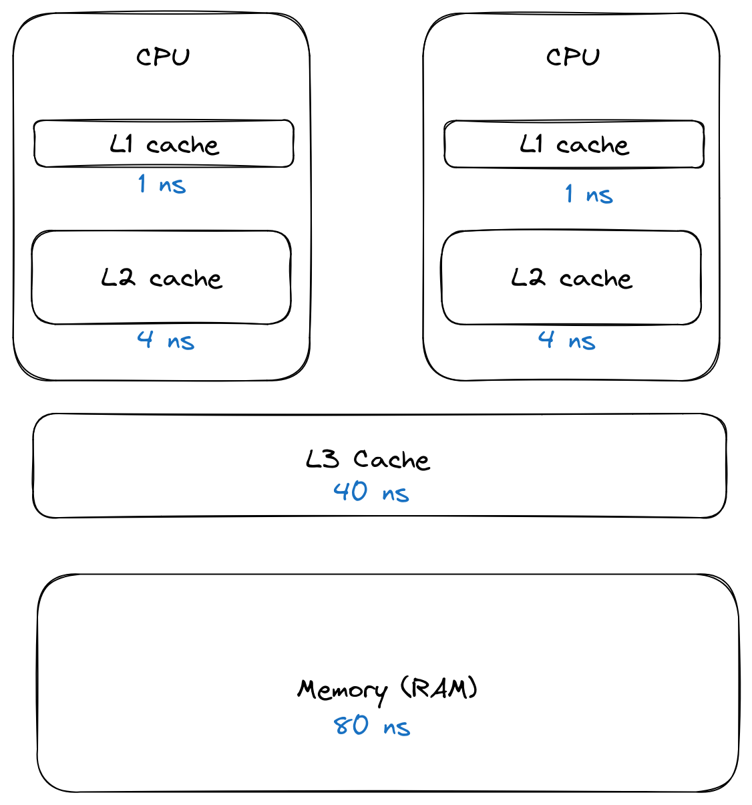

# Getting Friendly With Your CPU Cache
+++
title = "Getting Friendly With Your CPU Cache"
date = "FIXME"
tags = ["golang"]
categories = [ "golang" ]
url = "FIXME"
author = "mikit"
+++

## CPU Cache

When a CPU tries to access a piece of data, it first goes through three layers of cache before hitting the main memory.
The architecture looks something like this:

**Figure 1: CPU Cache**  




Figure 1 shows the layers of cache the CPU goes before it reaches the main memory. Each CPU has its own L1 and L2 cache, the L3 cache is shared among all CPUs.
The main memory is about 80 times slower than the L1 cache.
(source: [Memory Performance in a Nutshell][mem])

[mem]: https://www.intel.com/content/www/us/en/developer/articles/technical/memory-performance-in-a-nutshell.html

## An Example

This might be interesting, but how does that affect you as a developer?
Let's have a look...

Say you have a `User` struct in the following format:

**Listing 1: User struct**

```go
03 type Image [128 * 128]byte
04
05 type User struct {
06 	Login   string
07 	Active  bool
08 	Icon	Image
09 	Country string
10 }
```

Listing 1 shows the user struct. On line 08 you declare the `Image` field which is an array of 128×128 bytes.
You might be wondering *why* the icon is part of the `User` struct.
One reason would be to save an API call - when the client gets the user from the API, it doesn't need to make another call to get the icon.

Say you'd like to count the number of active users you have per country.
You write the following code:

**List 2: CountryCount**

```go
12 // CountryCount returns a map of country to number of active users.
13 func CountryCount(users []User) map[string]int{
14 	counts := make(map[string]int) // country -> count
15 	for _, u := range users {
16     	if !u.Active {
17         	continue
18     	}
19     	counts[u.Country]++
20 	}
21
22 	return counts
23 }
```

## Benchmarking the Code

You decide to benchmark your code, on average there are 10,000 users per query.
You write `bench_test.go` with the following code:

**Listing 2: Benchmark Code**

```go
05 var users []User
06
07 func init() {
08 	const size = 10_000
09 	countries := []string{
10     	"AD",
11     	"BB",
12     	"CA",
13     	"DK",
14 	}
15 	users = make([]User, size)
16 	for i := 0; i < size; i++ {
17     	users[i].Active = i%5 > 0 // 20% non active
18     	users[i].Country = countries[i%len(countries)]
19 	}
20 }
21
22 func BenchmarkCountryCount(b *testing.B) {
23 	for i := 0; i < b.N; i++ {
24     	m := CountryCount(users)
25     	if m == nil {
26         	b.Fatal(m)
27     	}
28 	}
29 }
```

Listing 2 shows the benchmark code.
On lines 07-20 you create a `users` slice with 10,000 users and set 20% of them to be non active.
On lines 22-29 is the benchmark function, it calls `CountryCount` in every loop.
On lines 25-27 you check that `m != nil` to make sure the compiler does not optimize away the call to `CountryCount`.

Now let's run the benchmark:

**Listing 3: Running the Benchmark**

```
01 $ go test -bench . -count 5
02 goos: linux
03 goarch: amd64
04 pkg: users
05 cpu: 12th Gen Intel(R) Core(TM) i7-1255U
06 BenchmarkCountryCount-12         	376   	3233320 ns/op
07 BenchmarkCountryCount-12         	374   	3313122 ns/op
08 BenchmarkCountryCount-12         	328   	3204089 ns/op
09 BenchmarkCountryCount-12         	360   	3190500 ns/op
10 BenchmarkCountryCount-12         	344   	3143776 ns/op
11 PASS
12 ok  	users	7.480s
```

Listing 3 shows how to run the benchmark. On line 01 you use the `-bench .` to run all benchmarks use the `-count` flag to run the benchmark 5 times.
On lines 06-10 you see the benchmark result. The results average to 3216961.40ns per operation, or about 3.21ms per operation.

You should have performance goals for your code, and if 3.21ms meets these goals - don't touch the code!
Let's assume you need better performance and start optimizing the code.

## Cache Misses

The code itself seems simple, but it's not cache friendly.
Let's take a look at my CPU cache sizes:

**Listing 4: CPU Cache information**

```
01 $ lscpu --caches
02 NAME ONE-SIZE ALL-SIZE WAYS TYPE    	LEVEL  SETS PHY-LINE COHERENCY-SIZE
03 L1d   	48K 	352K   12 Data        	1	64    	1         	64
04 L1i   	32K 	576K	8 Instruction 	1	64    	1         	64
05 L2   	1.3M 	6.5M   10 Unified     	2  2048    	1         	64
06 L3    	12M  	12M   12 Unified     	3 16384    	1         	64
```

Listing 4 shows how to get the CPU cache information. On line 01 we call the `lscpu` utility with the `--caches` flag.
One lines 03 to 06 we see the sizes of each cache. L1 is 48K, L2 is 1.3M and L3 is 12M.

When you look at our `Icon` type it's `128×128`bytes which is about 16k, you have 10,000 users in our `users` benchmark slice which is comes to about 163.8M (I ignore the other fields in the `User` struct since they don't contribute much to the struct size). This size of data does not fit in any of the caches.

To verify that cache misses are the cause of the issue, you can use the linux [perf][perf] utility.
`perf` works on an executable, so you need to run the test executable directly and not via `go test`.
By default, `go test` will delete the test executable at the end of the tests, but you can use the `-c` flag to keep it around.

[perf]: https://perf.wiki.kernel.org/index.php/Main_Page

**Listing 5: Building Test Executable**

```
01 $ go test -c
02 $ ls *.test
03 users.test
```

Listing 5 shows how to build the test executable. On line 01 you call `go test` with the `-c` flag and on line 02 you use the `ls` utility to see the name of the generated executable.

Once you have the test executable you can run it under `perf`.

**Listing 6: Running the Test Executable Under `perf`**

```
01 $ perf stat -e cache-misses ./users.test -test.bench . -test.count=5
02 goos: linux
03 goarch: amd64
04 pkg: users
05 cpu: 12th Gen Intel(R) Core(TM) i7-1255U
06 BenchmarkCountryCount-12         	345   	3528938 ns/op
07 BenchmarkCountryCount-12         	331   	3489025 ns/op
08 BenchmarkCountryCount-12         	344   	3496701 ns/op
09 BenchmarkCountryCount-12         	332   	3487785 ns/op
10 BenchmarkCountryCount-12         	330   	3434735 ns/op
11 PASS
12
13  Performance counter stats for './users.test -test.bench . -test.count=5':
14
15  	1,666,805,699  	cpu_core/cache-misses:u/                                            	(96.40%)
16  	1,333,851,719  	cpu_atom/cache-misses:u/                                            	(4.36%)
17
18    	7.707666261 seconds time elapsed
19
20    	7.737204000 seconds user
21    	0.016696000 seconds sys
22
23
```

Listing 6 shows how to run the test executable under the `perf` command. On line 01 you call `perf` telling it to collect cache misses events using the `-e cache-misses` flag. The rest of the arguments to `perf` are the command to run and its arguments. Since you run the test executable directly (and not via `go test`) you need to pass the flags to it with the `-test.` prefix.
On lines 15 and 16 we see the amount of cache misses. I have two sets of CPUs on my machine, but we'll focus on the core ones. There were about 1.6 billion cache misses during the execution of the benchmark.

## Using a Slice

How can we get better? We can use slices instead of arrays. A slice [is defined][slice] as:

[slice]: https://github.com/golang/go/blob/master/src/runtime/slice.go#L15

**Listing 7: Slice Implementation**

```go
01 type slice struct {
02    array unsafe.Pointer
03    len   int
04    cap   int
05 }
```

Listing 7 shows the implementation of slice in the Go runtime. On my machine every field is 64 bits or 8 bytes - a total of 24 bytes.

Let's change the `Image` implementation

**Listing 8: New Image**

```go
03 type Image []byte
04
05 type User struct {
06 	Login   string
07 	Active  bool
08 	Icon	Image
09 	Country string
10 }
```

Listing 7 shows the new implementation of `Image` and `User`, the only change is on line 03 which makes it a byte slice.

Go allocates the full size of any array automatically.
To be fair let's change the benchmark code to allocate memory for the icons in the initialization of `users`.

**Listing 9: New Initialization**

```go
07 func init() {
08 	const size = 10_000
09 	countries := []string{
10     	"AD",
11     	"BB",
12     	"CA",
13     	"DK",
14 	}
15 	users = make([]User, size)
16 	for i := 0; i < size; i++ {
17     	users[i].Active = i%5 > 0 // 20% non active
18     	users[i].Country = countries[i%len(countries)]
19     	users[i].Icon = make([]byte, 128*128)
20 	}
21 }
```

Listing 9 shows the new benchmark code, the only change is the addition of line 19 that allocates memory for the `Icon` field.

Now we let's run the benchmark again.

**Listing 10: Running the Benchmark**

```
01 $ go test -bench . -count 5
02 goos: linux
03 goarch: amd64
04 pkg: users
05 cpu: 12th Gen Intel(R) Core(TM) i7-1255U
06 BenchmarkCountryCount-12       	21124     	58382 ns/op
07 BenchmarkCountryCount-12       	20442     	58994 ns/op
08 BenchmarkCountryCount-12       	20472     	58525 ns/op
09 BenchmarkCountryCount-12       	19894     	59722 ns/op
10 BenchmarkCountryCount-12       	20163     	59980 ns/op
11 PASS
12 ok  	users	9.079s
```

Listing 10 shows a running of the benchmark after the changes. The average of lines 06-10 is 59120.60ns per operation.
About 54.4 times faster than the previous version.

To make sure there are less cache misses, let's run the code under `perf` again.

**Listing 11: Running the Test Executable Under `perf`**

```
01 $ go test -c
02 $ perf stat -e cache-misses ./users.test -test.bench . -test.count=5
03 goos: linux
04 goarch: amd64
05 pkg: users
06 cpu: 12th Gen Intel(R) Core(TM) i7-1255U
07 BenchmarkCountryCount-12       	20756     	59736 ns/op
08 BenchmarkCountryCount-12       	20162     	58511 ns/op
09 BenchmarkCountryCount-12       	20114     	59946 ns/op
10 BenchmarkCountryCount-12       	19858     	59116 ns/op
11 BenchmarkCountryCount-12       	20235     	58823 ns/op
12 PASS
13
14  Performance counter stats for './users.test -test.bench . -test.count=5':
15
16        	654,670  	cpu_core/cache-misses:u/                                            	(98.40%)
17     	12,561,851  	cpu_atom/cache-misses:u/                                            	(2.13%)
18
19    	9.062694134 seconds time elapsed
20
21    	9.082485000 seconds user
22    	0.026707000 seconds sys
23
24
```

On listing 11 you run the benchmark code under `perf`. On line 01 you use `go test -c` to generate the test executable and on line 02 you run it under `perf`. On line 16 you can see 654,670 cache misses, much less than the previous 1,666,805,699.

The new `User` struct has an `Icon` field which is 32 bytes instead of the previous 128×128.
More data fits inside cache lines leading to faster code.

## Summary

One of the reasons I love optimizing code for my clients is the extent of knowledge I need to learn.
Not only data structures and algorithms, but also computer architecture, how the Go runtime works, networking and much more. And I also get to play with cool new tools (such as `perf`)

You got a significant performance boost from a small code change, but TANSTAAFL[^fl].
The code is riskier since now `Icon` might be `nil`.
You also need to allocate memory on the heap per `User` struct, heap allocation takes more time.
Lastly, the garbage collector needs to work harder since we have more data on the heap - but that is a discussion for another blog post.

If you want to read more on the subject, you can start with reading [Cache-oblivious algorithm][co] and following the links there.

[co]: https://en.wikipedia.org/wiki/Cache-oblivious_algorithm
[^fl]: [There ain't no such thing as a free lunch](https://en.wikipedia.org/wiki/There_ain%27t_no_such_thing_as_a_free_lunch)

